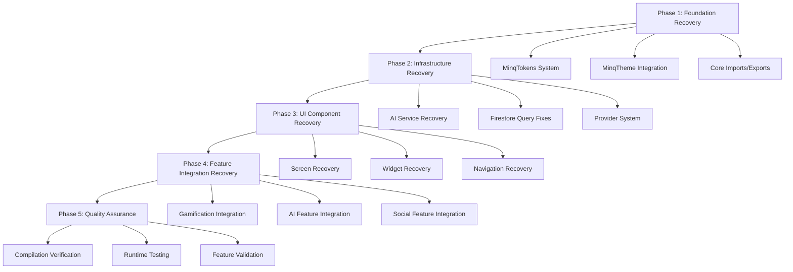
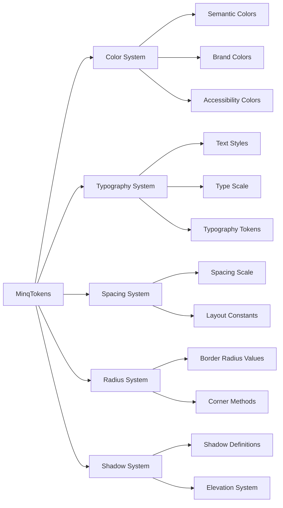
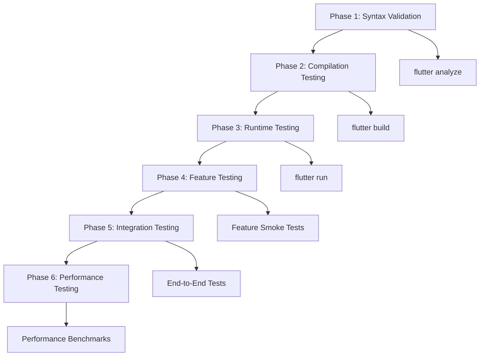

# Codebase Recovery Design Document

## Overview

This design document outlines the systematic approach to recover the MinQ Flutter application from its current state of 2000+ compilation errors to a fully functional, compilable, and runnable application. The recovery will be executed in phases, prioritizing critical infrastructure first, then UI components, and finally feature integration.

The recovery strategy focuses on:
1. **Foundation First**: Restore core design tokens and theme system
2. **Infrastructure Recovery**: Fix AI services and data layer
3. **UI Reconstruction**: Repair all broken UI components systematically
4. **Feature Preservation**: Ensure all implemented features remain functional
5. **Quality Assurance**: Achieve zero compilation errors and stable runtime

## Architecture

### Recovery Phase Architecture



### Design Token System Architecture



## Components and Interfaces

### 1. Design Token System Recovery

#### MinqTokens Enhancement
```dart
class MinqTokens {
  // Enhanced color system
  static const ColorScheme lightColorScheme = ColorScheme(...);
  static const ColorScheme darkColorScheme = ColorScheme(...);
  
  // Complete typography system
  static const TextTheme textTheme = TextTheme(...);
  
  // Comprehensive spacing system
  static const SpacingSystem spacing = SpacingSystem();
  
  // Complete radius system
  static const RadiusSystem radius = RadiusSystem();
  
  // Shadow system
  static const ShadowSystem shadows = ShadowSystem();
}
```

#### MinqTheme Implementation
```dart
class MinqTheme {
  static ThemeData light() => ThemeData(
    colorScheme: MinqTokens.lightColorScheme,
    textTheme: MinqTokens.textTheme,
    // Complete theme configuration
  );
  
  static ThemeData dark() => ThemeData(
    colorScheme: MinqTokens.darkColorScheme,
    textTheme: MinqTokens.textTheme,
    // Complete dark theme configuration
  );
}
```

#### Token Access Extension
```dart
extension MinqTokensExtension on BuildContext {
  MinqTokens get tokens => MinqTokens();
  ThemeData get theme => Theme.of(this);
  ColorScheme get colorScheme => Theme.of(this).colorScheme;
}
```

### 2. AI Service Recovery Architecture

#### TFLiteUnifiedAIService Enhancement
```dart
class TFLiteUnifiedAIService {
  // Ensure all methods return proper types
  Future<String> generateChatResponse(...) async;
  Future<List<HabitRecommendation>> recommendHabits(...) async;
  Future<FailurePrediction> predictFailure(...) async;
  Future<SentimentResult> analyzeSentiment(...) async;
  
  // Add missing integration methods
  Future<void> validateIntegration() async;
  Map<String, dynamic> getServiceStatus();
}
```

#### AI Integration Manager
```dart
class AIIntegrationManager {
  static final TFLiteUnifiedAIService _aiService = TFLiteUnifiedAIService.instance;
  
  // Centralized AI service coordination
  static Future<void> initializeAllServices() async;
  static Future<T> executeWithFallback<T>(Future<T> Function() aiCall, T fallback) async;
}
```

### 3. UI Component Recovery System

#### Component Recovery Strategy
1. **Syntax Error Fixing**: Convert malformed `_build` fields to proper methods
2. **Method Implementation**: Add missing method implementations
3. **Import Resolution**: Fix all missing imports and undefined references
4. **Type Safety**: Ensure all type annotations are correct
5. **State Management**: Verify provider and controller integrations

#### Widget Recovery Template
```dart
class RecoveredWidget extends StatelessWidget {
  const RecoveredWidget({Key? key}) : super(key: key);
  
  @override
  Widget build(BuildContext context) {
    final tokens = context.tokens;
    final theme = context.theme;
    
    return Container(
      // Proper token usage
      decoration: BoxDecoration(
        color: tokens.surface,
        borderRadius: tokens.cornerMedium(),
        boxShadow: tokens.shadowSoft,
      ),
      child: Text(
        'Content',
        style: tokens.typography.body,
      ),
    );
  }
}
```

### 4. Screen Recovery Architecture

#### Critical Screen Recovery Order
1. **Home Screen**: Core navigation and gamification display
2. **Settings Screens**: Configuration and preferences
3. **Quest Screens**: Core functionality screens
4. **AI-Powered Screens**: Advanced feature screens
5. **Specialized Screens**: Mood tracking, time capsule, etc.

#### Screen Recovery Template
```dart
class RecoveredScreen extends ConsumerWidget {
  const RecoveredScreen({Key? key}) : super(key: key);
  
  @override
  Widget build(BuildContext context, WidgetRef ref) {
    final tokens = context.tokens;
    
    return Scaffold(
      backgroundColor: tokens.background,
      appBar: AppBar(
        backgroundColor: tokens.surface,
        title: Text(
          'Screen Title',
          style: tokens.typography.h4,
        ),
      ),
      body: SafeArea(
        child: Padding(
          padding: tokens.breathingPadding,
          child: _buildContent(context, ref),
        ),
      ),
    );
  }
  
  Widget _buildContent(BuildContext context, WidgetRef ref) {
    // Proper content implementation
    return Container();
  }
}
```

## Data Models

### Recovery Progress Tracking
```dart
class RecoveryProgress {
  final int totalFiles;
  final int processedFiles;
  final int errorFiles;
  final List<String> remainingErrors;
  final Map<String, RecoveryStatus> fileStatus;
  
  double get completionPercentage => processedFiles / totalFiles;
  bool get isComplete => errorFiles == 0;
}

enum RecoveryStatus {
  pending,
  inProgress,
  completed,
  failed,
}
```

### Error Classification System
```dart
class CompilationError {
  final String file;
  final int line;
  final String errorType;
  final String message;
  final ErrorSeverity severity;
  final List<String> suggestedFixes;
}

enum ErrorSeverity {
  critical,    // Prevents compilation
  major,       // Causes runtime issues
  minor,       // Style/warning issues
}
```

## Error Handling

### Recovery Error Handling Strategy

1. **Graceful Degradation**: If a feature cannot be recovered immediately, provide a placeholder implementation
2. **Error Isolation**: Ensure errors in one component don't cascade to others
3. **Rollback Capability**: Maintain ability to revert changes if recovery introduces new issues
4. **Progress Tracking**: Monitor recovery progress and identify bottlenecks

### Error Recovery Patterns

```dart
// Pattern 1: Safe Token Access
Widget buildWithTokens(BuildContext context) {
  try {
    final tokens = context.tokens;
    return _buildWithTokens(tokens);
  } catch (e) {
    // Fallback to basic styling
    return _buildWithFallback();
  }
}

// Pattern 2: AI Service Fallback
Future<String> getAIResponse(String input) async {
  try {
    return await TFLiteUnifiedAIService.instance.generateChatResponse(input);
  } catch (e) {
    // Provide rule-based fallback
    return _generateFallbackResponse(input);
  }
}

// Pattern 3: Component Recovery
Widget recoverComponent(Widget Function() builder) {
  try {
    return builder();
  } catch (e) {
    return ErrorWidget.withDetails(
      message: 'Component recovery in progress',
      error: e,
    );
  }
}
```

## Testing Strategy

### Recovery Validation Approach

1. **Compilation Testing**: Verify zero compilation errors after each phase
2. **Runtime Testing**: Ensure application starts and basic navigation works
3. **Feature Testing**: Validate that recovered features maintain their functionality
4. **Integration Testing**: Test interactions between recovered components
5. **Performance Testing**: Ensure recovery doesn't introduce performance regressions

### Testing Phases



### Automated Recovery Validation

```dart
class RecoveryValidator {
  static Future<ValidationResult> validateRecovery() async {
    final results = <ValidationCheck>[];
    
    // Check compilation
    results.add(await _validateCompilation());
    
    // Check runtime startup
    results.add(await _validateRuntime());
    
    // Check feature functionality
    results.add(await _validateFeatures());
    
    return ValidationResult(results);
  }
  
  static Future<ValidationCheck> _validateCompilation() async {
    // Run flutter analyze and check for errors
  }
  
  static Future<ValidationCheck> _validateRuntime() async {
    // Test application startup
  }
  
  static Future<ValidationCheck> _validateFeatures() async {
    // Test core features
  }
}
```

### Recovery Success Metrics

1. **Zero Compilation Errors**: `flutter analyze` reports no errors
2. **Successful Build**: `flutter build` completes without issues
3. **Clean Startup**: Application launches without crashes
4. **Feature Preservation**: All 49 master task features remain functional
5. **Performance Maintenance**: No significant performance degradation
6. **Code Quality**: Maintainable, well-structured code

## Implementation Phases

### Phase 1: Foundation Recovery (Priority 1)
- Restore MinqTokens system completely
- Implement MinqTheme class
- Fix core imports and exports
- Establish token access patterns

### Phase 2: Infrastructure Recovery (Priority 1)
- Fix TFLiteUnifiedAIService integration
- Repair Firestore query syntax
- Restore provider system functionality
- Fix data model serialization

### Phase 3: UI Component Recovery (Priority 2)
- Fix all malformed `_build` fields
- Implement missing methods
- Resolve undefined references
- Restore proper widget structure

### Phase 4: Screen Recovery (Priority 2)
- Recover critical screens systematically
- Fix navigation and routing
- Restore screen-specific functionality
- Integrate with recovered services

### Phase 5: Feature Integration Recovery (Priority 3)
- Validate gamification features
- Test AI feature integration
- Verify social features
- Confirm premium features

### Phase 6: Quality Assurance (Priority 1)
- Achieve zero compilation errors
- Validate runtime stability
- Test all user flows
- Performance optimization

This design provides a comprehensive, systematic approach to recovering the MinQ codebase while preserving all implemented features and ensuring long-term maintainability.