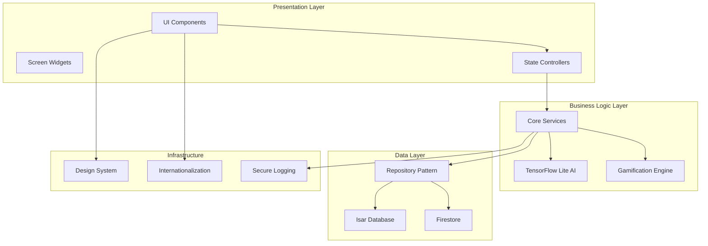
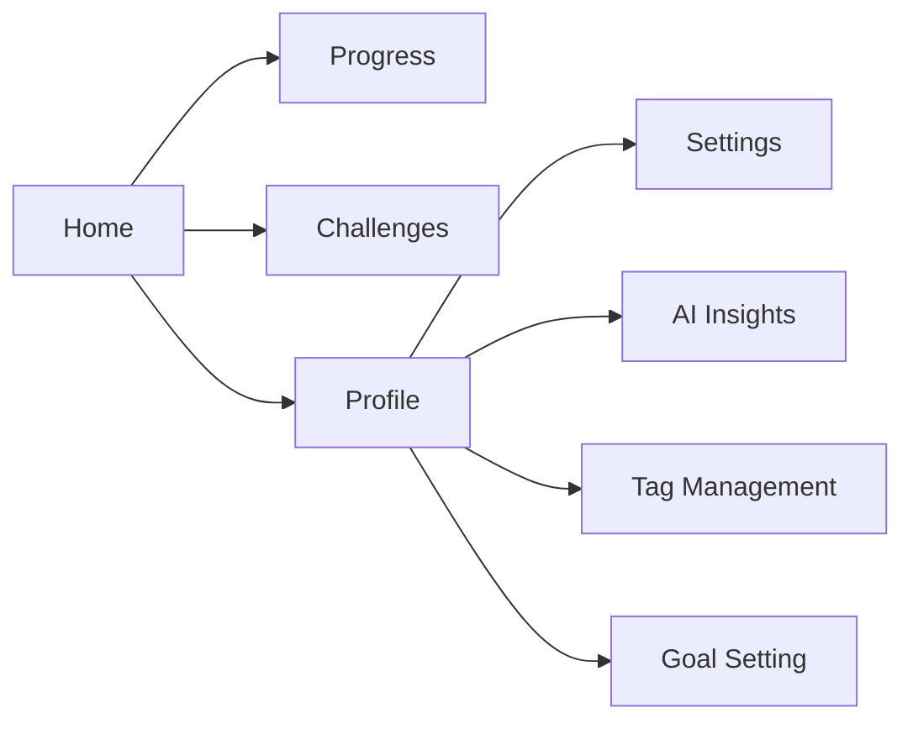
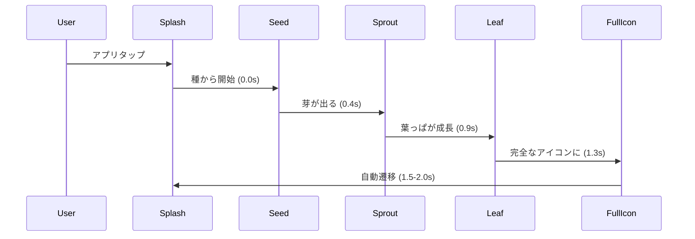
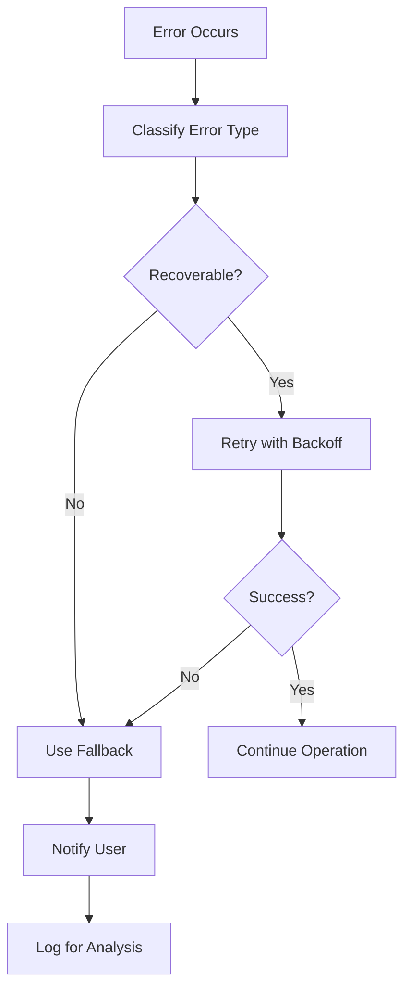

# MinQ App Comprehensive Improvements - Design Document

## Overview

This design document outlines the comprehensive architectural and implementation approach for improving the MinQ habit tracking application. The design addresses the 20 requirements identified in the requirements document, focusing on removing legacy code, enhancing UI/UX, implementing proper AI features, and ensuring stability and performance.

## Architecture

### High-Level Architecture Changes



### Key Architectural Decisions

1. **Clean Architecture**: Implement proper separation of concerns with clear layer boundaries
2. **Repository Pattern**: Abstract data access to support both Isar and Firestore seamlessly
3. **State Management**: Use Riverpod for consistent state management across the app
4. **Design System**: Centralized theme system with design tokens for consistency
5. **AI Integration**: Replace Gemma AI with TensorFlow Lite for stable local processing

## Components and Interfaces

### 1. Navigation System Redesign

#### Bottom Navigation Simplification
- **Current**: 6 tabs (Home, Stats, Challenges, Pair, Quests, Settings)
- **New**: 4 tabs (Home, Progress, Challenges, Profile)
- **Settings Integration**: Move to Profile screen with hamburger menu

```dart
enum MainNavigationTab {
  home(0, Icons.home, 'ホーム'),
  progress(1, Icons.bar_chart, '進捗'),
  challenges(2, Icons.emoji_events, 'チャレンジ'),
  profile(3, Icons.person, 'プロフィール');
}
```

#### Navigation Flow


### 2. AI Concierge Redesign

#### From Chat to Dashboard
- **Remove**: Chat-based interaction
- **Add**: Data insight dashboard with visual analytics
- **Components**:
  - Habit completion trends
  - Personalized recommendations
  - Progress insights
  - Failure prediction alerts

```dart
class AIInsightsDashboard {
  final HabitAnalytics analytics;
  final List<PersonalizedRecommendation> recommendations;
  final FailurePrediction? prediction;
  final ProgressInsights insights;
}
```

### 3. Enhanced Splash Screen - Organic Growth Animation

#### アイコンの成長をテーマにした意味のあるアニメーション
現在の4秒の起動時間を2秒に短縮し、アプリのアイデンティティ（習慣の成長）を表現するアニメーションに変革します。

**現在の問題点:**
- 起動時間が4秒と長すぎる
- アプリアイコンが小さすぎる
- アニメーションがアプリの意味と関係ない
- 煩わしい「前回のセッションを復元しますか」画面が表示される

**新しい設計:**

##### 1. 自然な成長アニメーション シーケンス (1.5-2.0秒)


##### 2. 成長アニメーションの詳細設計

**Stage 1: 種の段階 (0.0-0.4s)**
- 小さな種（点）から開始
- 土の中で脈動するような微細な動き
- 背景は深い土色から明るい色へのグラデーション

**Stage 2: 発芽の段階 (0.4-0.9s)**
- 種から小さな芽がにょきっと出現
- 上向きの成長アニメーション
- 背景が土色から緑がかった色に変化

**Stage 3: 葉っぱの成長 (0.9-1.3s)**
- 芽から葉っぱが展開
- 有機的な曲線を描きながら成長
- 葉っぱが風に揺れるような微細な動き

**Stage 4: 完成形 (1.3-1.5/2.0s)**
- 完全なアプリアイコンの形に
- 最終的なスケールアップ
- 軽やかなバウンス効果で完成を表現
- 初期化完了に応じて1.5-2.0秒の間で自動遷移

```dart
class OrganicGrowthAnimation {
  final AnimationController masterController;
  final Animation<double> seedPulse;
  final Animation<double> sproutGrowth;
  final Animation<double> leafExpansion;
  final Animation<double> finalScale;
  final Animation<Color?> backgroundTransition;

  // 成長段階
  enum GrowthStage {
    seed,      // 種の段階
    sprout,    // 発芽段階
    leafGrowth,// 葉っぱ成長
    mature,    // 成熟したアイコン
  }
}
```

##### 3. パフォーマンス最適化（1.5-2.0秒起動）

**初期化の並列処理:**
```dart
class OptimalInitializationService {
  static Future<void> initializeApp() async {
    final stopwatch = Stopwatch()..start();

    // 並列で実行して起動時間を最適化
    await Future.wait([
      _initializeDatabase(),      // 0.6s
      _initializeAIService(),     // 1.0s
      _loadUserPreferences(),     // 0.4s
      _initializeTheme(),         // 0.2s
    ]);

    final elapsed = stopwatch.elapsedMilliseconds;

    // アニメーションが自然に見える最小時間を確保
    if (elapsed < 1500) {
      await Future.delayed(Duration(milliseconds: 1500 - elapsed));
    }

    stopwatch.stop();
  }

  // 重い処理は遅延読み込み
  static void initializeLazyServices() {
    Future.microtask(() async {
      await _initializeAnalytics();
      await _initializeNotifications();
      await _preloadAssets();
    });
  }
}
```

**アニメーション最適化:**
```dart
class OptimizedGrowthAnimation {
  final bool useHardwareAcceleration = true;
  final int targetFPS = 60;
  final Duration minDuration = Duration(milliseconds: 1500);
  final Duration maxDuration = Duration(milliseconds: 2000);

  // 自然な成長カーブ
  static final Curve growthCurve = Curves.easeOutBack;
  static final Curve leafCurve = Curves.elasticOut;

  // 初期化進行に応じて動的に調整
  Duration calculateOptimalDuration(bool initializationComplete) {
    if (initializationComplete) {
      return minDuration; // 1.5秒で完了
    } else {
      return maxDuration; // 最大2.0秒まで延長
    }
  }

  // メモリ効率的なアニメーション
  Widget buildOptimizedAnimation() {
    return RepaintBoundary(
      child: AnimatedBuilder(
        animation: masterController,
        builder: (context, child) {
          return CustomPaint(
            painter: GrowthPainter(
              progress: masterController.value,
              stage: _getCurrentStage(),
            ),
            size: Size(120, 120), // 大きなアイコンサイズ
          );
        },
      ),
    );
  }
}
```

##### 4. 有機的な視覚効果

**背景の変化:**
```dart
class OrganicBackground {
  static List<Color> getColorsForStage(GrowthStage stage) {
    switch (stage) {
      case GrowthStage.seed:
        return [Color(0xFF8B4513), Color(0xFF654321)]; // 土色
      case GrowthStage.sprout:
        return [Color(0xFF654321), Color(0xFF90EE90)]; // 土から緑へ
      case GrowthStage.leafGrowth:
        return [Color(0xFF90EE90), Color(0xFF32CD32)]; // 明るい緑
      case GrowthStage.mature:
        return [Color(0xFF32CD32), Color(0xFFFFFFFF)]; // 緑から白へ
    }
  }
}
```

**自然な動きの実装:**
```dart
class NaturalMotion {
  // 風に揺れる葉っぱの動き
  static Animation<double> createLeafSway(AnimationController controller) {
    return Tween<double>(
      begin: -0.05,
      end: 0.05,
    ).animate(CurvedAnimation(
      parent: controller,
      curve: Curves.easeInOut,
    ));
  }

  // 有機的な成長カーブ
  static Animation<double> createGrowthAnimation(AnimationController controller) {
    return Tween<double>(
      begin: 0.0,
      end: 1.0,
    ).animate(CurvedAnimation(
      parent: controller,
      curve: Interval(0.0, 1.0, curve: Curves.easeOutBack),
    ));
  }
}
```

##### 5. アクセシビリティ対応
```dart
class AccessibleGrowthAnimation {
  final bool respectsReducedMotion;
  final String semanticLabel = "MinQアプリが起動しています。習慣の種が成長中...";

  // モーション感度設定に応じた代替アニメーション
  Widget buildAlternativeAnimation() {
    return AnimatedOpacity(
      duration: Duration(milliseconds: 1000),
      opacity: 1.0,
      child: ScaleTransition(
        scale: Tween(begin: 0.8, end: 1.0).animate(
          CurvedAnimation(parent: controller, curve: Curves.easeOut)
        ),
        child: AppIcon(size: 120),
      ),
    );
  }
}
```

##### 6. 実装クラス構造
```dart
class OrganicSplashScreen extends StatefulWidget {
  @override
  _OrganicSplashScreenState createState() => _OrganicSplashScreenState();
}

class _OrganicSplashScreenState extends State<OrganicSplashScreen>
    with TickerProviderStateMixin {

  late AnimationController _masterController;
  late OrganicGrowthAnimation _growthAnimation;

  @override
  void initState() {
    super.initState();
    _initializeAnimations();
    _startGrowthSequence();
  }

  Future<void> _startGrowthSequence() async {
    final stopwatch = Stopwatch()..start();

    // アニメーションと初期化を並列実行
    final animationFuture = _masterController.forward();
    final initializationFuture = OptimalInitializationService.initializeApp();

    // 初期化完了を監視
    bool initComplete = false;
    initializationFuture.then((_) => initComplete = true);

    // アニメーションが自然に見える時間を確保
    await Future.delayed(Duration(milliseconds: 1300)); // 成長完了まで

    // 初期化完了を待つ（最大700ms追加で合計2.0s）
    if (!initComplete) {
      await initializationFuture.timeout(
        Duration(milliseconds: 700),
        onTimeout: () {}, // タイムアウトしても続行
      );
    }

    // 遅延読み込みサービスを開始（バックグラウンド）
    OptimalInitializationService.initializeLazyServices();

    // セッション復元ダイアログをスキップして直接メイン画面へ
    _navigateToMainApp();
  }

  void _navigateToMainApp() {
    Navigator.of(context).pushReplacement(
      PageRouteBuilder(
        pageBuilder: (context, animation, _) => MainApp(),
        transitionDuration: Duration(milliseconds: 300),
        transitionsBuilder: (context, animation, _, child) {
          return FadeTransition(opacity: animation, child: child);
        },
      ),
    );
  }
}
```

##### 7. 起動時間短縮の技術的詳細

**Critical Path の最適化:**
```dart
class StartupOptimization {
  // 必須の初期化を1.5秒以内に完了
  static Future<void> criticalInitialization() async {
    await Future.wait([
      _initializeMinimalDatabase(),  // 0.5s
      _loadEssentialPreferences(),   // 0.3s
      _initializeBasicTheme(),       // 0.2s
    ]);
  }

  // 非必須の初期化は遅延実行
  static void deferredInitialization() {
    Timer(Duration(milliseconds: 100), () async {
      await _initializeFullAIService();
      await _loadAllPreferences();
      await _initializeAnalytics();
      await _preloadImages();
    });
  }

  // アニメーションと初期化のバランス調整
  static Duration calculateOptimalTiming() {
    // 初期化が早く完了した場合でも、アニメーションが自然に見える最小時間を確保
    // 初期化が遅い場合は最大2.0秒でタイムアウト
    return Duration(milliseconds: 1500); // 理想的なバランス
  }
}
```

この設計により、アプリのアイデンティティを表現する意味のある成長アニメーションと、1.5-2.0秒の自然で快適な起動体験を実現します。

### 4. Settings Screen Reorganization

#### New Structure
```
Profile Screen
├── Personal Settings
│   ├── Profile Picture & Name
│   ├── Tag Management
│   └── Goal Setting
├── App Preferences
│   ├── Theme (Light/Dark)
│   ├── AI Coach Speed
│   └── Notification Settings
├── AI Insights Dashboard
└── Advanced Settings (Hamburger Menu)
    ├── Data Export
    ├── Privacy Settings
    └── About
```

### 5. Design System Enhancement

#### Design Tokens Structure
```dart
class MinqDesignTokens {
  // Colors
  final ColorScheme colors;
  final Color brandPrimary;
  final Color brandSecondary;

  // Typography
  final TextTheme typography;

  // Spacing
  final SpacingSystem spacing;

  // Radius
  final RadiusSystem radius;

  // Elevation
  final ElevationSystem elevation;
}
```

#### Button Design Evolution
- **From**: Basic circular shapes
- **To**: Refined designs with proper shadows, gradients, and micro-interactions
- **Accessibility**: Minimum 44pt touch targets
- **States**: Clear hover, pressed, and disabled states

## Data Models

### 1. User Profile Enhancement

```dart
class UserProfile {
  final String id;
  final String displayName;
  final String? profileImageUrl;
  final List<String> tags;
  final Map<String, dynamic> goals;
  final AICoachPreferences aiPreferences;
  final ThemePreferences themePreferences;
  final NotificationPreferences notificationPreferences;
}

class AICoachPreferences {
  final double speed; // 0.5 to 2.0
  final CoachPersonality personality;
  final bool enableFailurePrediction;
  final bool enableRealTimeCoaching;
}
```

### 2. AI Insights Data Model

```dart
class AIInsights {
  final String userId;
  final DateTime generatedAt;
  final HabitCompletionTrends trends;
  final List<PersonalizedRecommendation> recommendations;
  final ProgressAnalysis progressAnalysis;
  final FailurePrediction? failurePrediction;
}

class PersonalizedRecommendation {
  final String id;
  final RecommendationType type;
  final String title;
  final String description;
  final double confidence;
  final List<String> relatedHabits;
}
```

### 3. Gamification System

```dart
class GamificationState {
  final int currentLevel;
  final int totalPoints;
  final int pointsToNextLevel;
  final List<Badge> earnedBadges;
  final List<Achievement> recentAchievements;
  final StreakInfo currentStreak;
}

class Achievement {
  final String id;
  final String title;
  final String description;
  final AchievementType type;
  final DateTime earnedAt;
  final bool isNew;
}
```

## Error Handling

### 1. Custom Exception Hierarchy

```dart
abstract class MinqException implements Exception {
  final String message;
  final String? code;
  final dynamic originalError;

  const MinqException(this.message, {this.code, this.originalError});
}

class AIServiceException extends MinqException {
  const AIServiceException(super.message, {super.code, super.originalError});
}

class DatabaseException extends MinqException {
  const DatabaseException(super.message, {super.code, super.originalError});
}

class NetworkException extends MinqException {
  const NetworkException(super.message, {super.code, super.originalError});
}
```

### 2. Error Recovery Strategies



### 3. Crash Recovery Removal

- **Remove**: Annoying "restore previous session" dialogs
- **Replace**: Silent background recovery with automatic state restoration
- **Implementation**: Use app lifecycle callbacks to save/restore state transparently

## Testing Strategy

### 1. Unit Testing Focus Areas

- **AI Service Integration**: Mock TensorFlow Lite responses
- **State Management**: Test Riverpod providers and controllers
- **Data Layer**: Repository pattern with mock implementations
- **Error Handling**: Custom exception handling and recovery

### 2. Integration Testing

- **Navigation Flow**: Test simplified bottom navigation
- **AI Dashboard**: Verify data insights generation
- **Theme System**: Test light/dark mode switching
- **Internationalization**: Verify .arb file integration

### 3. Performance Testing

- **Splash Screen**: Animation performance on low-end devices
- **Database Operations**: Isar query performance
- **Memory Usage**: Prevent memory leaks in long-running sessions
- **Startup Time**: Measure and optimize app launch time

### 4. Accessibility Testing

- **Screen Reader**: VoiceOver/TalkBack compatibility
- **Touch Targets**: Minimum 44pt size verification
- **Color Contrast**: WCAG AA compliance (4.5:1 ratio)
- **Motion Preferences**: Respect user motion settings

## Implementation Phases

### Phase 1: Foundation (Weeks 1-2)
1. Remove Gemma AI remnants
2. Implement TensorFlow Lite AI service
3. Set up proper error handling and logging
4. Create design token system

### Phase 2: Navigation & UI (Weeks 3-4)
1. Redesign bottom navigation (6→4 tabs)
2. Enhance splash screen with ChatGPT-style animation
3. Reorganize settings screen
4. Implement profile management features

### Phase 3: AI & Insights (Weeks 5-6)
1. Build AI insights dashboard
2. Implement data visualization components
3. Add personalized recommendations
4. Integrate failure prediction

### Phase 4: Polish & Performance (Weeks 7-8)
1. Fix layout and overflow issues
2. Optimize performance and memory usage
3. Implement comprehensive internationalization
4. Add accessibility features

### Phase 5: Testing & Refinement (Weeks 9-10)
1. Comprehensive testing across all features
2. Performance optimization
3. Bug fixes and stability improvements
4. Final UI/UX polish

## Technical Considerations

### 1. Performance Optimization

- **Lazy Loading**: Load screens and features on demand
- **Image Optimization**: Compress and cache images efficiently
- **Animation Performance**: Use hardware acceleration where possible
- **Memory Management**: Proper disposal of controllers and streams

### 2. Accessibility Compliance

- **WCAG 2.1 AA**: Meet accessibility guidelines
- **Semantic Labels**: Provide meaningful descriptions for screen readers
- **Focus Management**: Logical tab order and focus indicators
- **Motion Sensitivity**: Respect user preferences for reduced motion

### 3. Internationalization Strategy

- **ARB Files**: Extract all hardcoded strings to .arb files
- **Context-Aware Translation**: Provide context for translators
- **RTL Support**: Prepare for right-to-left languages
- **Cultural Adaptation**: Consider cultural differences in UI/UX

### 4. Security Considerations

- **Local AI Processing**: Keep sensitive data on device
- **Secure Logging**: Avoid logging sensitive information
- **Data Encryption**: Encrypt local database if needed
- **API Security**: Secure communication with backend services

This design provides a comprehensive roadmap for implementing all 20 requirements while maintaining code quality, performance, and user experience standards.