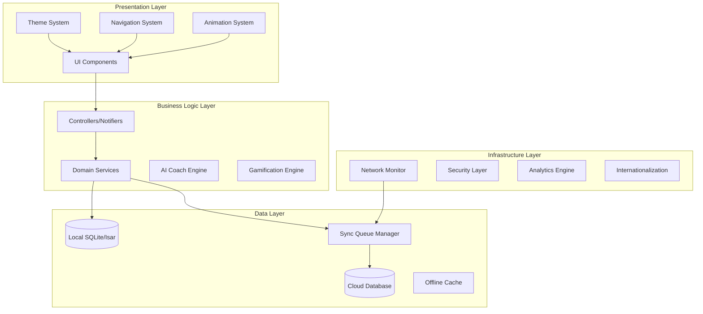
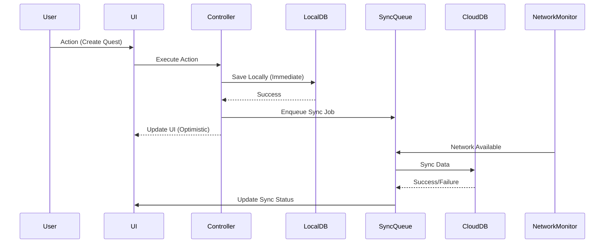

# UI/UX包括改善 設計書

## 概要

本設計書では、UI/UX改善フォルダで特定された12の問題点（F001-F012）の解決と、完全オフライン機能、ペア・ソーシャル機能、リーグ・ランキングシステム、最新UIベストプラクティスを統合した包括的なアーキテクチャを定義します。

## アーキテクチャ概要

### 全体アーキテクチャ



### オフラインファーストアーキテクチャ



## コンポーネント設計

### 1. テーマシステム（MinqTheme v2.0）

#### 新カラーパレット実装

```dart
// lib/presentation/theme/color_palette_v2.dart
class MinqColorPalette {
  // Brand Colors
  static const Color midnightIndigo = Color(0xFF4F46E5);
  static const Color auroraViolet = Color(0xFF8B5CF6);
  static const Color horizonTeal = Color(0xFF14B8A6);
  
  // Light Theme
  static const ColorTokens light = ColorTokens(
    // Primary
    primary: midnightIndigo,
    primaryHover: Color(0xFF4338CA),
    onPrimary: Colors.white,
    
    // Secondary
    secondary: auroraViolet,
    onSecondary: Colors.white,
    
    // Tertiary
    tertiary: horizonTeal,
    onTertiary: Colors.white,
    
    // Surfaces
    background: Color(0xFFF5F7FB),
    surface: Colors.white,
    surfaceAlt: Color(0xFFF8FAFC),
    surfaceVariant: Color(0xFFE2E8F0),
    
    // Text
    textPrimary: Color(0xFF0F172A),
    textSecondary: Color(0xFF475569),
    textMuted: Color(0xFF94A3B8),
    
    // Semantic Colors
    success: Color(0xFF10B981),
    warning: Color(0xFFF59E0B),
    error: Color(0xFFEF4444),
    info: Color(0xFF0284C7),
    
    // Interactive
    focusRing: Color(0xFF93C5FD),
    border: Color(0xFFE2E8F0),
    overlay: Color(0x990F172A),
  );
  
  // Dark Theme
  static const ColorTokens dark = ColorTokens(
    // Primary
    primary: Color(0xFF818CF8),
    primaryHover: Color(0xFFA5B4FC),
    onPrimary: Color(0xFF0B1120),
    
    // Secondary
    secondary: Color(0xFFA78BFA),
    onSecondary: Color(0xFF0B1120),
    
    // Tertiary
    tertiary: Color(0xFF2DD4BF),
    onTertiary: Color(0xFF0B1120),
    
    // Surfaces
    background: Color(0xFF0B1120),
    surface: Color(0xFF0F172A),
    surfaceAlt: Color(0xFF111827),
    surfaceVariant: Color(0xFF334155),
    
    // Text
    textPrimary: Color(0xFFE5E7EB),
    textSecondary: Color(0xFF9CA3AF),
    textMuted: Color(0xFF64748B),
    
    // Semantic Colors
    success: Color(0xFF34D399),
    warning: Color(0xFFFBBF24),
    error: Color(0xFFF87171),
    info: Color(0xFF38BDF8),
    
    // Interactive
    focusRing: Color(0xFF60A5FA),
    border: Color(0xFF334155),
    overlay: Color(0x99000000),
  );
}
```

#### コンポーネントテーママッピング

```dart
// lib/presentation/theme/component_themes.dart
class MinqComponentThemes {
  static AppBarTheme appBarTheme(ColorTokens colors) => AppBarTheme(
    backgroundColor: colors.surface,
    foregroundColor: colors.textPrimary,
    elevation: 1,
    shadowColor: colors.border,
    scrolledUnderElevation: 2,
  );
  
  static BottomNavigationBarThemeData bottomNavTheme(ColorTokens colors) =>
    BottomNavigationBarThemeData(
      backgroundColor: colors.surface,
      selectedItemColor: colors.primary,
      unselectedItemColor: colors.textSecondary,
      type: BottomNavigationBarType.fixed,
      elevation: 8,
    );
  
  static ElevatedButtonThemeData elevatedButtonTheme(ColorTokens colors) =>
    ElevatedButtonThemeData(
      style: ElevatedButton.styleFrom(
        backgroundColor: colors.primary,
        foregroundColor: colors.onPrimary,
        elevation: 2,
        shadowColor: colors.primary.withOpacity(0.3),
        shape: RoundedRectangleBorder(
          borderRadius: BorderRadius.circular(12),
        ),
      ),
    );
  
  static InputDecorationTheme inputDecorationTheme(ColorTokens colors) =>
    InputDecorationTheme(
      filled: true,
      fillColor: colors.surfaceAlt,
      border: OutlineInputBorder(
        borderSide: BorderSide(color: colors.border),
        borderRadius: BorderRadius.circular(12),
      ),
      focusedBorder: OutlineInputBorder(
        borderSide: BorderSide(color: colors.focusRing, width: 2),
        borderRadius: BorderRadius.circular(12),
      ),
      errorBorder: OutlineInputBorder(
        borderSide: BorderSide(color: colors.error, width: 2),
        borderRadius: BorderRadius.circular(12),
      ),
    );
}
```

### 2. オフラインファーストデータ層

#### ローカルデータベース設計

```dart
// lib/data/local/local_database.dart
@collection
class LocalQuest {
  Id id = Isar.autoIncrement;
  late String questId;
  late String title;
  late String description;
  late DateTime createdAt;
  late DateTime updatedAt;
  late bool isCompleted;
  late bool needsSync;
  late String syncStatus; // 'pending', 'syncing', 'synced', 'failed'
  List<String> tags = [];
  int priority = 0;
  DateTime? dueDate;
  int xpReward = 10;
}

@collection
class LocalUser {
  Id id = Isar.autoIncrement;
  late String userId;
  late String displayName;
  late String email;
  String? avatarSeed;
  String? bio;
  List<String> focusTags = [];
  late DateTime updatedAt;
  late bool needsSync;
  late String syncStatus;
  int currentXP = 0;
  int currentLevel = 1;
  String currentLeague = 'bronze';
}

@collection
class LocalChallenge {
  Id id = Isar.autoIncrement;
  late String challengeId;
  late String title;
  late String description;
  late DateTime startDate;
  late DateTime endDate;
  late bool isActive;
  late int progress;
  late int targetValue;
  late bool needsSync;
  late String syncStatus;
  int xpReward = 50;
}
```

#### 同期キューマネージャー

```dart
// lib/core/sync/sync_queue_manager.dart
class SyncQueueManager {
  final Isar _isar;
  final NetworkStatusService _networkService;
  final CloudDatabaseService _cloudService;
  
  Future<void> enqueueSyncJob(SyncJob job) async {
    await _isar.writeTxn(() async {
      await _isar.syncJobs.put(job);
    });
    
    if (_networkService.isOnline) {
      _processSyncQueue();
    }
  }
  
  Future<void> _processSyncQueue() async {
    final pendingJobs = await _isar.syncJobs
        .filter()
        .statusEqualTo(SyncStatus.pending)
        .sortByPriority()
        .findAll();
    
    for (final job in pendingJobs) {
      try {
        job.status = SyncStatus.syncing;
        await _isar.writeTxn(() => _isar.syncJobs.put(job));
        
        final result = await _executeSyncJob(job);
        
        if (result.isSuccess) {
          await _isar.writeTxn(() => _isar.syncJobs.delete(job.id));
        } else {
          job.retryCount++;
          job.status = job.retryCount >= maxRetries 
              ? SyncStatus.failed 
              : SyncStatus.pending;
          job.nextRetryAt = DateTime.now().add(
            Duration(seconds: math.pow(2, job.retryCount).toInt())
          );
          await _isar.writeTxn(() => _isar.syncJobs.put(job));
        }
      } catch (e) {
        // Handle sync error
      }
    }
  }
}

@collection
class SyncJob {
  Id id = Isar.autoIncrement;
  late String entityType; // 'quest', 'user', 'challenge'
  late String entityId;
  late String operation; // 'create', 'update', 'delete'
  late Map<String, dynamic> data;
  late DateTime createdAt;
  DateTime? nextRetryAt;
  int retryCount = 0;
  int priority = 0; // Higher number = higher priority
  @enumerated
  late SyncStatus status;
}

enum SyncStatus { pending, syncing, synced, failed }
```

### 3. ネットワーク状態管理

```dart
// lib/core/network/network_status_service.dart
class NetworkStatusService extends StateNotifier<NetworkStatus> {
  final Connectivity _connectivity;
  StreamSubscription<ConnectivityResult>? _subscription;
  
  NetworkStatusService(this._connectivity) : super(NetworkStatus.unknown) {
    _initializeNetworkMonitoring();
  }
  
  void _initializeNetworkMonitoring() {
    _subscription = _connectivity.onConnectivityChanged.listen((result) {
      _updateNetworkStatus(result);
    });
    
    // Initial check
    _connectivity.checkConnectivity().then(_updateNetworkStatus);
  }
  
  void _updateNetworkStatus(ConnectivityResult result) {
    final newStatus = result == ConnectivityResult.none 
        ? NetworkStatus.offline 
        : NetworkStatus.online;
    
    if (state != newStatus) {
      state = newStatus;
      
      if (newStatus == NetworkStatus.online) {
        // Trigger sync queue processing
        ref.read(syncQueueManagerProvider).processPendingJobs();
      }
    }
  }
}

enum NetworkStatus { online, offline, unknown }

final networkStatusProvider = StateNotifierProvider<NetworkStatusService, NetworkStatus>(
  (ref) => NetworkStatusService(Connectivity()),
);
```

### 4. AIコーチエンジン

#### 動的プロンプト生成システム

```dart
// lib/core/ai/ai_coach_engine.dart
class AiCoachEngine {
  final TFLiteUnifiedAiService _aiService;
  final UserProgressService _progressService;
  
  Future<AiCoachResponse> generateResponse(String userMessage) async {
    final userProgress = await _progressService.getCurrentProgress();
    final systemPrompt = _buildDynamicSystemPrompt(userProgress);
    
    final response = await _aiService.generateResponse(
      systemPrompt: systemPrompt,
      userMessage: userMessage,
      context: _buildContextData(userProgress),
    );
    
    return AiCoachResponse(
      message: response.message,
      quickActions: _generateQuickActions(userProgress),
      encouragementLevel: _calculateEncouragementLevel(userProgress),
      suggestions: _generateSuggestions(userProgress),
    );
  }
  
  String _buildDynamicSystemPrompt(UserProgress progress) {
    final streakInfo = progress.currentStreak > 0
        ? 'ユーザーの現在のストリークは${progress.currentStreak}日です。'
        : 'ユーザーはまだストリークを開始していません。';
    
    final recentQuests = progress.recentCompletedQuests.isNotEmpty
        ? '最近完了したクエスト: ${progress.recentCompletedQuests.take(3).join(', ')}'
        : '最近完了したクエストはありません。';
    
    final focusTags = progress.focusTags.isNotEmpty
        ? 'ユーザーの関心分野: ${progress.focusTags.join(', ')}'
        : '';
    
    return '''
あなたはMinQアプリのAIコーチです。ユーザーの習慣化を支援し、ポジティブで具体的なアドバイスを提供してください。

ユーザー情報:
- $streakInfo
- $recentQuests
- $focusTags
- 現在のレベル: ${progress.currentLevel}
- 現在のXP: ${progress.currentXP}
- 現在のリーグ: ${progress.currentLeague}

応答は以下の形式で提供してください:
1. 励ましのメッセージ
2. 具体的なアドバイス
3. 次のアクション提案
''';
  }
  
  List<QuickAction> _generateQuickActions(UserProgress progress) {
    final actions = <QuickAction>[];
    
    if (progress.todayQuestsCount == 0) {
      actions.add(QuickAction(
        id: 'create_quest',
        title: '今日のクエストを作成',
        icon: Icons.add_task,
        route: '/create-quest',
      ));
    }
    
    if (progress.hasActiveQuests) {
      actions.add(QuickAction(
        id: 'start_timer',
        title: 'タイマーを開始',
        icon: Icons.timer,
        route: '/quest-timer',
      ));
    }
    
    if (progress.currentStreak > 0) {
      actions.add(QuickAction(
        id: 'view_progress',
        title: '進捗を確認',
        icon: Icons.trending_up,
        route: '/stats',
      ));
    }
    
    return actions;
  }
}

class AiCoachResponse {
  final String message;
  final List<QuickAction> quickActions;
  final EncouragementLevel encouragementLevel;
  final List<String> suggestions;
  
  const AiCoachResponse({
    required this.message,
    required this.quickActions,
    required this.encouragementLevel,
    required this.suggestions,
  });
}

class QuickAction {
  final String id;
  final String title;
  final IconData icon;
  final String route;
  
  const QuickAction({
    required this.id,
    required this.title,
    required this.icon,
    required this.route,
  });
}
```

### 5. リーグ・ランキングシステム

#### リーグ管理エンジン

```dart
// lib/core/gamification/league_system.dart
class LeagueSystem {
  static const Map<String, LeagueConfig> leagues = {
    'bronze': LeagueConfig(
      name: 'ブロンズリーグ',
      color: Color(0xFFB45309),
      minXP: 0,
      maxXP: 999,
      promotionThreshold: 800,
      relegationThreshold: 0,
    ),
    'silver': LeagueConfig(
      name: 'シルバーリーグ',
      color: Color(0xFF9CA3AF),
      minXP: 1000,
      maxXP: 2999,
      promotionThreshold: 2500,
      relegationThreshold: 1200,
    ),
    'gold': LeagueConfig(
      name: 'ゴールドリーグ',
      color: Color(0xFFF59E0B),
      minXP: 3000,
      maxXP: 6999,
      promotionThreshold: 6000,
      relegationThreshold: 3500,
    ),
    'platinum': LeagueConfig(
      name: 'プラチナリーグ',
      color: Color(0xFF8B5CF6),
      minXP: 7000,
      maxXP: 14999,
      promotionThreshold: 13000,
      relegationThreshold: 8000,
    ),
    'diamond': LeagueConfig(
      name: 'ダイヤモンドリーグ',
      color: Color(0xFF14B8A6),
      minXP: 15000,
      maxXP: 999999,
      promotionThreshold: 999999,
      relegationThreshold: 16000,
    ),
  };
  
  Future<LeaguePromotion?> checkPromotion(String userId) async {
    final user = await _userRepository.getUser(userId);
    final currentLeague = leagues[user.currentLeague]!;
    
    if (user.weeklyXP >= currentLeague.promotionThreshold) {
      final nextLeague = _getNextLeague(user.currentLeague);
      if (nextLeague != null) {
        return LeaguePromotion(
          fromLeague: user.currentLeague,
          toLeague: nextLeague,
          xpEarned: user.weeklyXP,
          rewards: _calculatePromotionRewards(nextLeague),
        );
      }
    }
    
    return null;
  }
  
  Future<List<LeagueRanking>> getLeagueRankings(String league) async {
    return await _userRepository.getLeagueRankings(
      league: league,
      limit: 50,
    );
  }
}

class LeagueConfig {
  final String name;
  final Color color;
  final int minXP;
  final int maxXP;
  final int promotionThreshold;
  final int relegationThreshold;
  
  const LeagueConfig({
    required this.name,
    required this.color,
    required this.minXP,
    required this.maxXP,
    required this.promotionThreshold,
    required this.relegationThreshold,
  });
}
```

#### XPシステム

```dart
// lib/core/gamification/xp_system.dart
class XPSystem {
  static const Map<String, int> baseXPRewards = {
    'quest_complete': 10,
    'mini_quest_complete': 5,
    'challenge_complete': 50,
    'streak_milestone': 20,
    'weekly_goal': 100,
    'monthly_goal': 500,
  };
  
  Future<XPGainResult> awardXP({
    required String userId,
    required String action,
    required Map<String, dynamic> context,
  }) async {
    final baseXP = baseXPRewards[action] ?? 0;
    final multiplier = _calculateMultiplier(action, context);
    final bonusXP = _calculateBonusXP(action, context);
    
    final totalXP = (baseXP * multiplier).round() + bonusXP;
    
    final user = await _userRepository.getUser(userId);
    final oldLevel = user.currentLevel;
    
    user.currentXP += totalXP;
    user.weeklyXP += totalXP;
    user.totalXP += totalXP;
    
    final newLevel = _calculateLevel(user.totalXP);
    final leveledUp = newLevel > oldLevel;
    
    if (leveledUp) {
      user.currentLevel = newLevel;
    }
    
    await _userRepository.updateUser(user);
    
    return XPGainResult(
      xpGained: totalXP,
      newTotalXP: user.totalXP,
      leveledUp: leveledUp,
      newLevel: newLevel,
      rewards: leveledUp ? _getLevelUpRewards(newLevel) : [],
    );
  }
  
  double _calculateMultiplier(String action, Map<String, dynamic> context) {
    double multiplier = 1.0;
    
    // Streak bonus
    final streak = context['streak'] as int? ?? 0;
    if (streak > 0) {
      multiplier += (streak / 10).clamp(0.0, 2.0);
    }
    
    // Difficulty bonus
    final difficulty = context['difficulty'] as String? ?? 'normal';
    switch (difficulty) {
      case 'easy':
        multiplier *= 0.8;
        break;
      case 'hard':
        multiplier *= 1.5;
        break;
      case 'expert':
        multiplier *= 2.0;
        break;
    }
    
    return multiplier;
  }
  
  int _calculateBonusXP(String action, Map<String, dynamic> context) {
    int bonus = 0;
    
    // Perfect completion bonus
    if (context['perfect'] == true) {
      bonus += 5;
    }
    
    // Early completion bonus
    if (context['early_completion'] == true) {
      bonus += 3;
    }
    
    // First time bonus
    if (context['first_time'] == true) {
      bonus += 10;
    }
    
    return bonus;
  }
}
```

### 6. ペア・ソーシャル機能

#### ペアシステム設計

```dart
// lib/core/social/pair_system.dart
class PairSystem {
  Future<PairInvitation> createInvitation(String userId) async {
    final inviteCode = _generateInviteCode();
    final deepLink = 'minq://pair/invite/$inviteCode';
    
    final invitation = PairInvitation(
      id: _generateId(),
      inviterId: userId,
      inviteCode: inviteCode,
      deepLink: deepLink,
      qrCode: await _generateQRCode(deepLink),
      expiresAt: DateTime.now().add(Duration(days: 7)),
      createdAt: DateTime.now(),
    );
    
    await _pairRepository.saveInvitation(invitation);
    return invitation;
  }
  
  Future<PairConnection> acceptInvitation(String inviteCode, String userId) async {
    final invitation = await _pairRepository.getInvitationByCode(inviteCode);
    
    if (invitation == null || invitation.isExpired) {
      throw PairException('Invalid or expired invitation');
    }
    
    final connection = PairConnection(
      id: _generateId(),
      user1Id: invitation.inviterId,
      user2Id: userId,
      status: PairStatus.active,
      createdAt: DateTime.now(),
      settings: PairSettings.defaultSettings(),
    );
    
    await _pairRepository.createConnection(connection);
    await _pairRepository.deleteInvitation(invitation.id);
    
    // Send notification to inviter
    await _notificationService.sendPairAcceptedNotification(
      invitation.inviterId,
      userId,
    );
    
    return connection;
  }
  
  Future<void> shareProgress(String pairId, ProgressShare share) async {
    final connection = await _pairRepository.getConnection(pairId);
    
    if (connection == null || !connection.isActive) {
      throw PairException('Invalid pair connection');
    }
    
    await _pairRepository.addProgressShare(pairId, share);
    
    // Send real-time update to pair
    final partnerId = connection.getPartnerId(share.userId);
    await _realtimeService.sendProgressUpdate(partnerId, share);
    
    // Send push notification if enabled
    if (connection.settings.progressNotifications) {
      await _notificationService.sendProgressNotification(partnerId, share);
    }
  }
}

@collection
class PairConnection {
  Id id = Isar.autoIncrement;
  late String connectionId;
  late String user1Id;
  late String user2Id;
  @enumerated
  late PairStatus status;
  late DateTime createdAt;
  DateTime? endedAt;
  late PairSettings settings;
  
  String getPartnerId(String userId) {
    return userId == user1Id ? user2Id : user1Id;
  }
  
  bool get isActive => status == PairStatus.active;
}

class PairSettings {
  final bool progressNotifications;
  final bool chatNotifications;
  final bool challengeInvites;
  final bool weeklyReports;
  
  const PairSettings({
    required this.progressNotifications,
    required this.chatNotifications,
    required this.challengeInvites,
    required this.weeklyReports,
  });
  
  static PairSettings defaultSettings() => PairSettings(
    progressNotifications: true,
    chatNotifications: true,
    challengeInvites: true,
    weeklyReports: true,
  );
}
```

### 7. UI コンポーネント設計

#### リーグランキングUI

```dart
// lib/presentation/widgets/league/league_ranking_widget.dart
class LeagueRankingWidget extends ConsumerWidget {
  final String league;
  
  const LeagueRankingWidget({required this.league});
  
  @override
  Widget build(BuildContext context, WidgetRef ref) {
    final rankings = ref.watch(leagueRankingsProvider(league));
    final currentUser = ref.watch(currentUserProvider);
    
    return rankings.when(
      data: (data) => _buildRankingList(context, data, currentUser),
      loading: () => _buildLoadingState(),
      error: (error, stack) => _buildErrorState(error),
    );
  }
  
  Widget _buildRankingList(
    BuildContext context,
    List<LeagueRanking> rankings,
    User currentUser,
  ) {
    return CustomScrollView(
      slivers: [
        // League Header
        SliverToBoxAdapter(
          child: LeagueHeaderCard(league: league),
        ),
        
        // Top 3 Podium
        SliverToBoxAdapter(
          child: PodiumWidget(topThree: rankings.take(3).toList()),
        ),
        
        // Ranking List
        SliverList(
          delegate: SliverChildBuilderDelegate(
            (context, index) {
              final ranking = rankings[index + 3]; // Skip top 3
              final isCurrentUser = ranking.userId == currentUser.id;
              
              return AnimatedContainer(
                duration: Duration(milliseconds: 300),
                margin: EdgeInsets.symmetric(horizontal: 16, vertical: 4),
                decoration: BoxDecoration(
                  color: isCurrentUser 
                      ? context.tokens.primary.withOpacity(0.1)
                      : context.tokens.surface,
                  borderRadius: BorderRadius.circular(12),
                  border: isCurrentUser 
                      ? Border.all(color: context.tokens.primary, width: 2)
                      : null,
                ),
                child: RankingListTile(
                  ranking: ranking,
                  isCurrentUser: isCurrentUser,
                ),
              );
            },
            childCount: math.max(0, rankings.length - 3),
          ),
        ),
      ],
    );
  }
}

class PodiumWidget extends StatelessWidget {
  final List<LeagueRanking> topThree;
  
  const PodiumWidget({required this.topThree});
  
  @override
  Widget build(BuildContext context) {
    return Container(
      height: 200,
      padding: EdgeInsets.all(16),
      child: Row(
        mainAxisAlignment: MainAxisAlignment.spaceEvenly,
        crossAxisAlignment: CrossAxisAlignment.end,
        children: [
          if (topThree.length > 1) _buildPodiumPlace(context, topThree[1], 2),
          if (topThree.isNotEmpty) _buildPodiumPlace(context, topThree[0], 1),
          if (topThree.length > 2) _buildPodiumPlace(context, topThree[2], 3),
        ],
      ),
    );
  }
  
  Widget _buildPodiumPlace(BuildContext context, LeagueRanking ranking, int place) {
    final height = place == 1 ? 120.0 : place == 2 ? 100.0 : 80.0;
    final colors = [
      context.tokens.warning, // Gold
      Color(0xFF9CA3AF), // Silver
      Color(0xFFB45309), // Bronze
    ];
    
    return Column(
      mainAxisAlignment: MainAxisAlignment.end,
      children: [
        // Crown for 1st place
        if (place == 1)
          Icon(
            Icons.emoji_events,
            color: colors[place - 1],
            size: 32,
          ),
        
        // Avatar
        CircleAvatar(
          radius: 24,
          backgroundImage: NetworkImage(ranking.avatarUrl),
        ),
        
        SizedBox(height: 8),
        
        // Name
        Text(
          ranking.displayName,
          style: context.textTheme.bodySmall,
          maxLines: 1,
          overflow: TextOverflow.ellipsis,
        ),
        
        // XP
        Text(
          '${ranking.weeklyXP} XP',
          style: context.textTheme.bodySmall?.copyWith(
            color: context.tokens.textSecondary,
          ),
        ),
        
        SizedBox(height: 8),
        
        // Podium
        AnimatedContainer(
          duration: Duration(milliseconds: 800),
          curve: Curves.elasticOut,
          width: 60,
          height: height,
          decoration: BoxDecoration(
            color: colors[place - 1],
            borderRadius: BorderRadius.vertical(top: Radius.circular(8)),
            gradient: LinearGradient(
              begin: Alignment.topCenter,
              end: Alignment.bottomCenter,
              colors: [
                colors[place - 1],
                colors[place - 1].withOpacity(0.7),
              ],
            ),
          ),
          child: Center(
            child: Text(
              '$place',
              style: TextStyle(
                color: Colors.white,
                fontSize: 24,
                fontWeight: FontWeight.bold,
              ),
            ),
          ),
        ),
      ],
    );
  }
}
```

#### XP獲得アニメーション

```dart
// lib/presentation/widgets/gamification/xp_gain_animation.dart
class XPGainAnimation extends StatefulWidget {
  final int xpGained;
  final VoidCallback? onComplete;
  
  const XPGainAnimation({
    required this.xpGained,
    this.onComplete,
  });
  
  @override
  State<XPGainAnimation> createState() => _XPGainAnimationState();
}

class _XPGainAnimationState extends State<XPGainAnimation>
    with TickerProviderStateMixin {
  late AnimationController _controller;
  late AnimationController _particleController;
  late Animation<double> _scaleAnimation;
  late Animation<double> _opacityAnimation;
  late Animation<Offset> _slideAnimation;
  
  @override
  void initState() {
    super.initState();
    
    _controller = AnimationController(
      duration: Duration(milliseconds: 2000),
      vsync: this,
    );
    
    _particleController = AnimationController(
      duration: Duration(milliseconds: 1500),
      vsync: this,
    );
    
    _scaleAnimation = Tween<double>(
      begin: 0.0,
      end: 1.0,
    ).animate(CurvedAnimation(
      parent: _controller,
      curve: Interval(0.0, 0.3, curve: Curves.elasticOut),
    ));
    
    _opacityAnimation = Tween<double>(
      begin: 1.0,
      end: 0.0,
    ).animate(CurvedAnimation(
      parent: _controller,
      curve: Interval(0.7, 1.0, curve: Curves.easeOut),
    ));
    
    _slideAnimation = Tween<Offset>(
      begin: Offset.zero,
      end: Offset(0, -2),
    ).animate(CurvedAnimation(
      parent: _controller,
      curve: Curves.easeOut,
    ));
    
    _startAnimation();
  }
  
  void _startAnimation() async {
    await _controller.forward();
    _particleController.forward();
    
    if (widget.onComplete != null) {
      widget.onComplete!();
    }
  }
  
  @override
  Widget build(BuildContext context) {
    return AnimatedBuilder(
      animation: _controller,
      builder: (context, child) {
        return SlideTransition(
          position: _slideAnimation,
          child: ScaleTransition(
            scale: _scaleAnimation,
            child: FadeTransition(
              opacity: _opacityAnimation,
              child: Container(
                padding: EdgeInsets.symmetric(horizontal: 16, vertical: 8),
                decoration: BoxDecoration(
                  color: context.tokens.success,
                  borderRadius: BorderRadius.circular(20),
                  boxShadow: [
                    BoxShadow(
                      color: context.tokens.success.withOpacity(0.3),
                      blurRadius: 8,
                      spreadRadius: 2,
                    ),
                  ],
                ),
                child: Row(
                  mainAxisSize: MainAxisSize.min,
                  children: [
                    Icon(
                      Icons.stars,
                      color: Colors.white,
                      size: 20,
                    ),
                    SizedBox(width: 8),
                    Text(
                      '+${widget.xpGained} XP',
                      style: TextStyle(
                        color: Colors.white,
                        fontWeight: FontWeight.bold,
                        fontSize: 16,
                      ),
                    ),
                  ],
                ),
              ),
            ),
          ),
        );
      },
    );
  }
  
  @override
  void dispose() {
    _controller.dispose();
    _particleController.dispose();
    super.dispose();
  }
}
```

## データモデル

### ユーザープロフィール拡張

```dart
// lib/domain/user/user_profile.dart
@freezed
class UserProfile with _$UserProfile {
  const factory UserProfile({
    required String id,
    required String displayName,
    required String email,
    String? avatarSeed,
    String? bio,
    @Default([]) List<String> focusTags,
    @Default(0) int currentXP,
    @Default(1) int currentLevel,
    @Default(0) int weeklyXP,
    @Default(0) int totalXP,
    @Default('bronze') String currentLeague,
    @Default(0) int currentStreak,
    @Default(0) int longestStreak,
    DateTime? lastActiveDate,
    @Default(UserSettings()) UserSettings settings,
    required DateTime createdAt,
    required DateTime updatedAt,
  }) = _UserProfile;
  
  factory UserProfile.fromJson(Map<String, dynamic> json) =>
      _$UserProfileFromJson(json);
}

@freezed
class UserSettings with _$UserSettings {
  const factory UserSettings({
    @Default(true) bool notificationsEnabled,
    @Default(true) bool pairNotifications,
    @Default(true) bool leagueNotifications,
    @Default('system') String themeMode, // 'light', 'dark', 'system'
    @Default('primary') String accentColor,
    @Default(true) bool animationsEnabled,
    @Default(true) bool soundEnabled,
    @Default(true) bool hapticsEnabled,
    @Default('ja') String language,
    @Default(TimeOfDay(hour: 22, minute: 0)) TimeOfDay quietHoursStart,
    @Default(TimeOfDay(hour: 8, minute: 0)) TimeOfDay quietHoursEnd,
  }) = _UserSettings;
  
  factory UserSettings.fromJson(Map<String, dynamic> json) =>
      _$UserSettingsFromJson(json);
}
```

### チャレンジシステム

```dart
// lib/domain/challenges/challenge.dart
@freezed
class Challenge with _$Challenge {
  const factory Challenge({
    required String id,
    required String title,
    required String description,
    String? imageUrl,
    required ChallengeType type,
    required ChallengeDifficulty difficulty,
    required DateTime startDate,
    required DateTime endDate,
    required int targetValue,
    required String targetUnit,
    @Default(0) int currentProgress,
    @Default([]) List<String> tags,
    @Default(50) int xpReward,
    @Default([]) List<ChallengeReward> rewards,
    @Default(0) int participantCount,
    @Default(0) int completionCount,
    required bool isActive,
    required DateTime createdAt,
  }) = _Challenge;
  
  factory Challenge.fromJson(Map<String, dynamic> json) =>
      _$ChallengeFromJson(json);
}

enum ChallengeType {
  daily,
  weekly,
  monthly,
  seasonal,
  special,
}

enum ChallengeDifficulty {
  easy,
  normal,
  hard,
  expert,
}

@freezed
class ChallengeReward with _$ChallengeReward {
  const factory ChallengeReward({
    required String id,
    required ChallengeRewardType type,
    required String name,
    String? description,
    String? imageUrl,
    Map<String, dynamic>? metadata,
  }) = _ChallengeReward;
  
  factory ChallengeReward.fromJson(Map<String, dynamic> json) =>
      _$ChallengeRewardFromJson(json);
}

enum ChallengeRewardType {
  badge,
  title,
  theme,
  avatar,
  xpBoost,
  premiumFeature,
}
```

## エラーハンドリング

### 包括的エラー管理システム

```dart
// lib/core/error/error_handler.dart
class ErrorHandler {
  static void handleError(Object error, StackTrace stackTrace) {
    if (error is NetworkException) {
      _handleNetworkError(error);
    } else if (error is SyncException) {
      _handleSyncError(error);
    } else if (error is ValidationException) {
      _handleValidationError(error);
    } else {
      _handleUnknownError(error, stackTrace);
    }
  }
  
  static void _handleNetworkError(NetworkException error) {
    // Show offline banner
    // Queue operations for later sync
    // Provide offline alternatives
  }
  
  static void _handleSyncError(SyncException error) {
    // Retry with exponential backoff
    // Show sync status to user
    // Provide manual retry option
  }
  
  static void _handleValidationError(ValidationException error) {
    // Show user-friendly validation messages
    // Highlight problematic fields
    // Provide correction suggestions
  }
}

class AppException implements Exception {
  final String message;
  final String? code;
  final Map<String, dynamic>? metadata;
  
  const AppException(this.message, {this.code, this.metadata});
}

class NetworkException extends AppException {
  const NetworkException(String message) : super(message, code: 'NETWORK_ERROR');
}

class SyncException extends AppException {
  const SyncException(String message) : super(message, code: 'SYNC_ERROR');
}

class ValidationException extends AppException {
  final Map<String, String> fieldErrors;
  
  const ValidationException(String message, this.fieldErrors) 
      : super(message, code: 'VALIDATION_ERROR');
}
```

## テスト戦略

### テスト構成

```dart
// test/integration/offline_sync_test.dart
void main() {
  group('Offline Sync Integration Tests', () {
    testWidgets('should sync quest creation when network restored', (tester) async {
      // Setup offline environment
      await tester.pumpWidget(TestApp());
      
      // Create quest while offline
      await tester.tap(find.byKey(Key('create_quest_button')));
      await tester.enterText(find.byKey(Key('quest_title')), 'Test Quest');
      await tester.tap(find.byKey(Key('save_quest_button')));
      
      // Verify local storage
      final localQuests = await IsarService.instance.getQuests();
      expect(localQuests.length, 1);
      expect(localQuests.first.needsSync, true);
      
      // Restore network
      NetworkStatusService.instance.setOnline();
      await tester.pump(Duration(seconds: 2));
      
      // Verify sync completion
      final syncedQuests = await IsarService.instance.getQuests();
      expect(syncedQuests.first.needsSync, false);
      expect(syncedQuests.first.syncStatus, 'synced');
    });
  });
}

// test/widget/league_ranking_test.dart
void main() {
  group('League Ranking Widget Tests', () {
    testWidgets('should display podium for top 3 users', (tester) async {
      final mockRankings = [
        LeagueRanking(userId: '1', displayName: 'User 1', weeklyXP: 1000),
        LeagueRanking(userId: '2', displayName: 'User 2', weeklyXP: 800),
        LeagueRanking(userId: '3', displayName: 'User 3', weeklyXP: 600),
      ];
      
      await tester.pumpWidget(
        TestApp(
          child: LeagueRankingWidget(league: 'gold'),
          overrides: [
            leagueRankingsProvider('gold').overrideWith(
              (ref) => AsyncValue.data(mockRankings),
            ),
          ],
        ),
      );
      
      // Verify podium display
      expect(find.byType(PodiumWidget), findsOneWidget);
      expect(find.text('User 1'), findsOneWidget);
      expect(find.text('1000 XP'), findsOneWidget);
      
      // Verify crown for 1st place
      expect(find.byIcon(Icons.emoji_events), findsOneWidget);
    });
  });
}
```

## セキュリティ設計

### データ暗号化

```dart
// lib/core/security/encryption_service.dart
class EncryptionService {
  static const String _keyAlias = 'minq_master_key';
  
  Future<String> encryptSensitiveData(String data) async {
    final key = await _getMasterKey();
    final encrypter = Encrypter(AES(key));
    final iv = IV.fromSecureRandom(16);
    
    final encrypted = encrypter.encrypt(data, iv: iv);
    return '${iv.base64}:${encrypted.base64}';
  }
  
  Future<String> decryptSensitiveData(String encryptedData) async {
    final parts = encryptedData.split(':');
    final iv = IV.fromBase64(parts[0]);
    final encrypted = Encrypted.fromBase64(parts[1]);
    
    final key = await _getMasterKey();
    final encrypter = Encrypter(AES(key));
    
    return encrypter.decrypt(encrypted, iv: iv);
  }
  
  Future<Key> _getMasterKey() async {
    // Use Android Keystore / iOS Keychain for key storage
    final keyExists = await FlutterSecureStorage().containsKey(key: _keyAlias);
    
    if (!keyExists) {
      final key = Key.fromSecureRandom(32);
      await FlutterSecureStorage().write(
        key: _keyAlias,
        value: key.base64,
      );
      return key;
    }
    
    final keyString = await FlutterSecureStorage().read(key: _keyAlias);
    return Key.fromBase64(keyString!);
  }
}
```

### 認証・認可システム

```dart
// lib/core/auth/biometric_auth_service.dart
class BiometricAuthService {
  final LocalAuthentication _localAuth = LocalAuthentication();
  
  Future<bool> isBiometricAvailable() async {
    final isAvailable = await _localAuth.canCheckBiometrics;
    final isDeviceSupported = await _localAuth.isDeviceSupported();
    return isAvailable && isDeviceSupported;
  }
  
  Future<AuthResult> authenticateWithBiometrics() async {
    try {
      final isAuthenticated = await _localAuth.authenticate(
        localizedReason: 'MinQにアクセスするために認証してください',
        options: AuthenticationOptions(
          biometricOnly: true,
          stickyAuth: true,
        ),
      );
      
      return AuthResult(
        success: isAuthenticated,
        method: AuthMethod.biometric,
      );
    } catch (e) {
      return AuthResult(
        success: false,
        method: AuthMethod.biometric,
        error: e.toString(),
      );
    }
  }
  
  Future<AuthResult> authenticateWithPIN(String pin) async {
    final storedPinHash = await _secureStorage.read(key: 'user_pin_hash');
    final inputPinHash = _hashPIN(pin);
    
    final isValid = storedPinHash == inputPinHash;
    
    return AuthResult(
      success: isValid,
      method: AuthMethod.pin,
    );
  }
}
```

## パフォーマンス最適化設計

### 画像最適化システム

```dart
// lib/core/performance/image_optimization_service.dart
class ImageOptimizationService {
  static const int maxImageSize = 1024;
  static const int compressionQuality = 85;
  
  Future<File> optimizeImage(File originalImage) async {
    final image = img.decodeImage(await originalImage.readAsBytes());
    if (image == null) throw ImageProcessingException('Invalid image format');
    
    // Resize if too large
    img.Image resized = image;
    if (image.width > maxImageSize || image.height > maxImageSize) {
      resized = img.copyResize(
        image,
        width: image.width > image.height ? maxImageSize : null,
        height: image.height > image.width ? maxImageSize : null,
      );
    }
    
    // Compress
    final compressedBytes = img.encodeJpg(resized, quality: compressionQuality);
    
    // Save optimized image
    final optimizedFile = File('${originalImage.path}_optimized.jpg');
    await optimizedFile.writeAsBytes(compressedBytes);
    
    return optimizedFile;
  }
  
  Future<void> preloadCriticalImages() async {
    final criticalImages = [
      'assets/images/logo.png',
      'assets/images/onboarding_1.png',
      'assets/images/onboarding_2.png',
    ];
    
    for (final imagePath in criticalImages) {
      await precacheImage(AssetImage(imagePath), navigatorKey.currentContext!);
    }
  }
}
```

### メモリ管理システム

```dart
// lib/core/performance/memory_manager.dart
class MemoryManager {
  static const int maxCacheSize = 100 * 1024 * 1024; // 100MB
  final Map<String, CacheEntry> _cache = {};
  int _currentCacheSize = 0;
  
  void cacheData(String key, dynamic data) {
    final size = _calculateDataSize(data);
    
    // Remove old entries if cache is full
    while (_currentCacheSize + size > maxCacheSize && _cache.isNotEmpty) {
      _evictOldestEntry();
    }
    
    _cache[key] = CacheEntry(
      data: data,
      size: size,
      timestamp: DateTime.now(),
    );
    _currentCacheSize += size;
  }
  
  T? getCachedData<T>(String key) {
    final entry = _cache[key];
    if (entry == null) return null;
    
    // Update access time
    entry.lastAccessed = DateTime.now();
    return entry.data as T?;
  }
  
  void _evictOldestEntry() {
    if (_cache.isEmpty) return;
    
    final oldestKey = _cache.entries
        .reduce((a, b) => a.value.lastAccessed.isBefore(b.value.lastAccessed) ? a : b)
        .key;
    
    final entry = _cache.remove(oldestKey)!;
    _currentCacheSize -= entry.size;
  }
  
  void clearCache() {
    _cache.clear();
    _currentCacheSize = 0;
  }
}

class CacheEntry {
  final dynamic data;
  final int size;
  final DateTime timestamp;
  DateTime lastAccessed;
  
  CacheEntry({
    required this.data,
    required this.size,
    required this.timestamp,
  }) : lastAccessed = timestamp;
}
```

## 国際化・アクセシビリティ設計

### RTL言語サポート

```dart
// lib/presentation/widgets/rtl/rtl_support_widget.dart
class RTLSupportWidget extends StatelessWidget {
  final Widget child;
  
  const RTLSupportWidget({required this.child});
  
  @override
  Widget build(BuildContext context) {
    final isRTL = Directionality.of(context) == TextDirection.rtl;
    
    return Directionality(
      textDirection: isRTL ? TextDirection.rtl : TextDirection.ltr,
      child: child,
    );
  }
}

// lib/presentation/widgets/rtl/rtl_aware_padding.dart
class RTLAwarePadding extends StatelessWidget {
  final double? start;
  final double? end;
  final double? top;
  final double? bottom;
  final Widget child;
  
  const RTLAwarePadding({
    this.start,
    this.end,
    this.top,
    this.bottom,
    required this.child,
  });
  
  @override
  Widget build(BuildContext context) {
    final isRTL = Directionality.of(context) == TextDirection.rtl;
    
    return Padding(
      padding: EdgeInsetsDirectional.only(
        start: start ?? 0,
        end: end ?? 0,
        top: top ?? 0,
        bottom: bottom ?? 0,
      ),
      child: child,
    );
  }
}
```

### アクセシビリティ強化

```dart
// lib/core/accessibility/accessibility_service.dart
class AccessibilityService {
  static bool _isScreenReaderEnabled = false;
  static bool _isHighContrastEnabled = false;
  static double _textScaleFactor = 1.0;
  
  static Future<void> initialize() async {
    await _checkAccessibilitySettings();
    _setupAccessibilityListeners();
  }
  
  static Future<void> _checkAccessibilitySettings() async {
    // Check if screen reader is enabled
    _isScreenReaderEnabled = await _isScreenReaderActive();
    
    // Check if high contrast is enabled
    _isHighContrastEnabled = await _isHighContrastActive();
    
    // Get text scale factor
    _textScaleFactor = WidgetsBinding.instance.window.textScaleFactor;
  }
  
  static Widget makeAccessible(Widget child, {
    required String semanticLabel,
    String? semanticHint,
    bool excludeSemantics = false,
  }) {
    return Semantics(
      label: semanticLabel,
      hint: semanticHint,
      excludeSemantics: excludeSemantics,
      child: child,
    );
  }
  
  static Widget createAccessibleButton({
    required VoidCallback onPressed,
    required Widget child,
    required String semanticLabel,
    String? semanticHint,
  }) {
    return Semantics(
      label: semanticLabel,
      hint: semanticHint,
      button: true,
      enabled: true,
      child: InkWell(
        onTap: onPressed,
        borderRadius: BorderRadius.circular(8),
        child: Container(
          constraints: BoxConstraints(minHeight: 44, minWidth: 44),
          child: child,
        ),
      ),
    );
  }
}
```

## 高度なアニメーションシステム

### フルイドアニメーション

```dart
// lib/presentation/animations/fluid_animations.dart
class FluidAnimations {
  static Widget createLevelUpAnimation({
    required int newLevel,
    required VoidCallback onComplete,
  }) {
    return StatefulBuilder(
      builder: (context, setState) {
        return TweenAnimationBuilder<double>(
          duration: Duration(milliseconds: 2000),
          tween: Tween(begin: 0.0, end: 1.0),
          curve: Curves.elasticOut,
          onEnd: onComplete,
          builder: (context, value, child) {
            return Transform.scale(
              scale: 0.8 + (0.4 * value),
              child: Opacity(
                opacity: value,
                child: Container(
                  decoration: BoxDecoration(
                    gradient: RadialGradient(
                      colors: [
                        Colors.yellow.withOpacity(0.8),
                        Colors.orange.withOpacity(0.6),
                        Colors.transparent,
                      ],
                    ),
                  ),
                  child: Column(
                    mainAxisAlignment: MainAxisAlignment.center,
                    children: [
                      Icon(
                        Icons.emoji_events,
                        size: 80 * value,
                        color: Colors.yellow,
                      ),
                      SizedBox(height: 16),
                      Text(
                        'レベル $newLevel 達成！',
                        style: TextStyle(
                          fontSize: 24 * value,
                          fontWeight: FontWeight.bold,
                          color: Colors.white,
                        ),
                      ),
                    ],
                  ),
                ),
              ),
            );
          },
        );
      },
    );
  }
  
  static Widget createProgressBarAnimation({
    required double progress,
    required Color color,
    Duration duration = const Duration(milliseconds: 800),
  }) {
    return TweenAnimationBuilder<double>(
      duration: duration,
      tween: Tween(begin: 0.0, end: progress),
      curve: Curves.easeInOut,
      builder: (context, value, child) {
        return Container(
          height: 8,
          decoration: BoxDecoration(
            borderRadius: BorderRadius.circular(4),
            color: Colors.grey[300],
          ),
          child: FractionallySizedBox(
            widthFactor: value,
            alignment: Alignment.centerLeft,
            child: Container(
              decoration: BoxDecoration(
                borderRadius: BorderRadius.circular(4),
                gradient: LinearGradient(
                  colors: [
                    color,
                    color.withOpacity(0.7),
                  ],
                ),
                boxShadow: [
                  BoxShadow(
                    color: color.withOpacity(0.3),
                    blurRadius: 4,
                    spreadRadius: 1,
                  ),
                ],
              ),
            ),
          ),
        );
      },
    );
  }
}
```

### パーティクルシステム

```dart
// lib/presentation/animations/particle_system.dart
class ParticleSystem extends StatefulWidget {
  final int particleCount;
  final Color color;
  final Duration duration;
  
  const ParticleSystem({
    this.particleCount = 20,
    required this.color,
    this.duration = const Duration(seconds: 3),
  });
  
  @override
  State<ParticleSystem> createState() => _ParticleSystemState();
}

class _ParticleSystemState extends State<ParticleSystem>
    with TickerProviderStateMixin {
  late AnimationController _controller;
  late List<Particle> _particles;
  
  @override
  void initState() {
    super.initState();
    
    _controller = AnimationController(
      duration: widget.duration,
      vsync: this,
    );
    
    _particles = List.generate(widget.particleCount, (index) {
      return Particle(
        position: Offset(
          Random().nextDouble() * 300,
          Random().nextDouble() * 300,
        ),
        velocity: Offset(
          (Random().nextDouble() - 0.5) * 100,
          (Random().nextDouble() - 0.5) * 100,
        ),
        size: Random().nextDouble() * 4 + 2,
        color: widget.color,
        life: Random().nextDouble() * 0.5 + 0.5,
      );
    });
    
    _controller.forward();
  }
  
  @override
  Widget build(BuildContext context) {
    return AnimatedBuilder(
      animation: _controller,
      builder: (context, child) {
        return CustomPaint(
          painter: ParticlePainter(_particles, _controller.value),
          size: Size(300, 300),
        );
      },
    );
  }
  
  @override
  void dispose() {
    _controller.dispose();
    super.dispose();
  }
}

class Particle {
  Offset position;
  final Offset velocity;
  final double size;
  final Color color;
  final double life;
  
  Particle({
    required this.position,
    required this.velocity,
    required this.size,
    required this.color,
    required this.life,
  });
}

class ParticlePainter extends CustomPainter {
  final List<Particle> particles;
  final double animationValue;
  
  ParticlePainter(this.particles, this.animationValue);
  
  @override
  void paint(Canvas canvas, Size size) {
    for (final particle in particles) {
      final opacity = (1.0 - animationValue) * particle.life;
      if (opacity <= 0) continue;
      
      final paint = Paint()
        ..color = particle.color.withOpacity(opacity)
        ..style = PaintingStyle.fill;
      
      final currentPosition = Offset(
        particle.position.dx + particle.velocity.dx * animationValue,
        particle.position.dy + particle.velocity.dy * animationValue,
      );
      
      canvas.drawCircle(currentPosition, particle.size, paint);
    }
  }
  
  @override
  bool shouldRepaint(covariant CustomPainter oldDelegate) => true;
}
```

## 高度な検索・フィルターシステム

### 検索エンジン設計

```dart
// lib/core/search/search_engine.dart
class SearchEngine {
  final Map<String, SearchIndex> _indices = {};
  
  Future<void> buildIndex(String indexName, List<Searchable> items) async {
    final index = SearchIndex();
    
    for (final item in items) {
      final tokens = _tokenize(item.searchableText);
      for (final token in tokens) {
        index.addTerm(token, item.id);
      }
    }
    
    _indices[indexName] = index;
  }
  
  Future<SearchResult> search({
    required String query,
    required String indexName,
    List<SearchFilter>? filters,
    SearchSort? sort,
    int limit = 20,
  }) async {
    final index = _indices[indexName];
    if (index == null) return SearchResult.empty();
    
    final queryTokens = _tokenize(query);
    final matchingIds = <String, double>{};
    
    // Calculate relevance scores
    for (final token in queryTokens) {
      final termResults = index.searchTerm(token);
      for (final id in termResults) {
        matchingIds[id] = (matchingIds[id] ?? 0) + _calculateRelevance(token, query);
      }
    }
    
    // Apply filters
    if (filters != null) {
      for (final filter in filters) {
        matchingIds.removeWhere((id, score) => !filter.matches(id));
      }
    }
    
    // Sort results
    final sortedIds = matchingIds.entries.toList()
      ..sort((a, b) {
        if (sort != null) {
          return sort.compare(a.key, b.key);
        }
        return b.value.compareTo(a.value); // Default: by relevance
      });
    
    final limitedIds = sortedIds.take(limit).map((e) => e.key).toList();
    
    return SearchResult(
      ids: limitedIds,
      totalCount: matchingIds.length,
      query: query,
    );
  }
  
  List<String> _tokenize(String text) {
    return text
        .toLowerCase()
        .replaceAll(RegExp(r'[^\w\s]'), ' ')
        .split(RegExp(r'\s+'))
        .where((token) => token.isNotEmpty)
        .toList();
  }
  
  double _calculateRelevance(String token, String query) {
    // Simple relevance calculation
    if (token == query.toLowerCase()) return 1.0;
    if (token.startsWith(query.toLowerCase())) return 0.8;
    if (token.contains(query.toLowerCase())) return 0.6;
    return 0.4;
  }
}

class SearchIndex {
  final Map<String, Set<String>> _termToIds = {};
  
  void addTerm(String term, String id) {
    _termToIds.putIfAbsent(term, () => <String>{}).add(id);
  }
  
  Set<String> searchTerm(String term) {
    return _termToIds[term] ?? <String>{};
  }
}

abstract class Searchable {
  String get id;
  String get searchableText;
}

class SearchFilter {
  final String field;
  final dynamic value;
  final FilterOperator operator;
  
  const SearchFilter({
    required this.field,
    required this.value,
    required this.operator,
  });
  
  bool matches(String id) {
    // Implementation depends on data source
    return true;
  }
}

enum FilterOperator { equals, contains, greaterThan, lessThan, between }
```

## リアルタイム通信システム

### WebSocket管理

```dart
// lib/core/realtime/websocket_manager.dart
class WebSocketManager {
  WebSocketChannel? _channel;
  final StreamController<RealtimeMessage> _messageController = StreamController.broadcast();
  Timer? _heartbeatTimer;
  Timer? _reconnectTimer;
  int _reconnectAttempts = 0;
  static const int maxReconnectAttempts = 5;
  
  Stream<RealtimeMessage> get messageStream => _messageController.stream;
  
  Future<void> connect(String userId) async {
    try {
      final uri = Uri.parse('wss://api.minq.app/ws?userId=$userId');
      _channel = WebSocketChannel.connect(uri);
      
      _channel!.stream.listen(
        _handleMessage,
        onError: _handleError,
        onDone: _handleDisconnection,
      );
      
      _startHeartbeat();
      _reconnectAttempts = 0;
      
    } catch (e) {
      _scheduleReconnect();
    }
  }
  
  void _handleMessage(dynamic message) {
    try {
      final data = jsonDecode(message);
      final realtimeMessage = RealtimeMessage.fromJson(data);
      _messageController.add(realtimeMessage);
    } catch (e) {
      print('Error parsing message: $e');
    }
  }
  
  void _handleError(error) {
    print('WebSocket error: $error');
    _scheduleReconnect();
  }
  
  void _handleDisconnection() {
    print('WebSocket disconnected');
    _scheduleReconnect();
  }
  
  void _scheduleReconnect() {
    if (_reconnectAttempts >= maxReconnectAttempts) {
      print('Max reconnection attempts reached');
      return;
    }
    
    final delay = Duration(seconds: math.pow(2, _reconnectAttempts).toInt());
    _reconnectTimer = Timer(delay, () {
      _reconnectAttempts++;
      connect(_currentUserId);
    });
  }
  
  void _startHeartbeat() {
    _heartbeatTimer = Timer.periodic(Duration(seconds: 30), (timer) {
      sendMessage(RealtimeMessage(
        type: MessageType.heartbeat,
        data: {'timestamp': DateTime.now().toIso8601String()},
      ));
    });
  }
  
  void sendMessage(RealtimeMessage message) {
    if (_channel != null) {
      _channel!.sink.add(jsonEncode(message.toJson()));
    }
  }
  
  void disconnect() {
    _heartbeatTimer?.cancel();
    _reconnectTimer?.cancel();
    _channel?.sink.close();
    _messageController.close();
  }
}

@freezed
class RealtimeMessage with _$RealtimeMessage {
  const factory RealtimeMessage({
    required MessageType type,
    required Map<String, dynamic> data,
    String? targetUserId,
    DateTime? timestamp,
  }) = _RealtimeMessage;
  
  factory RealtimeMessage.fromJson(Map<String, dynamic> json) =>
      _$RealtimeMessageFromJson(json);
}

enum MessageType {
  heartbeat,
  pairProgressUpdate,
  challengeInvite,
  leagueRankingUpdate,
  chatMessage,
  notification,
}
```

## 高度なテスト戦略

### E2Eテストフレームワーク

```dart
// test/e2e/user_journey_test.dart
void main() {
  group('Complete User Journey E2E Tests', () {
    late IntegrationTestWidgetsFlutterBinding binding;
    
    setUpAll(() {
      binding = IntegrationTestWidgetsFlutterBinding.ensureInitialized();
    });
    
    testWidgets('New user onboarding to first quest completion', (tester) async {
      // Launch app
      await tester.pumpWidget(MinQApp());
      await tester.pumpAndSettle();
      
      // Complete onboarding
      await _completeOnboarding(tester);
      
      // Create first quest
      await _createFirstQuest(tester);
      
      // Complete quest
      await _completeQuest(tester);
      
      // Verify XP gain and level up
      await _verifyXPGain(tester);
      
      // Check AI coach response
      await _checkAICoachResponse(tester);
    });
    
    testWidgets('Offline quest creation and sync', (tester) async {
      await tester.pumpWidget(MinQApp());
      
      // Go offline
      await NetworkSimulator.goOffline();
      
      // Create quest while offline
      await _createQuestOffline(tester);
      
      // Verify local storage
      await _verifyLocalStorage(tester);
      
      // Go online
      await NetworkSimulator.goOnline();
      
      // Wait for sync
      await tester.pump(Duration(seconds: 5));
      
      // Verify sync completion
      await _verifySyncCompletion(tester);
    });
  });
}

Future<void> _completeOnboarding(WidgetTester tester) async {
  // Navigate through onboarding screens
  for (int i = 0; i < 3; i++) {
    await tester.tap(find.text('次へ'));
    await tester.pumpAndSettle();
  }
  
  // Set up profile
  await tester.enterText(find.byKey(Key('display_name_field')), 'テストユーザー');
  await tester.tap(find.byKey(Key('complete_onboarding_button')));
  await tester.pumpAndSettle();
}

Future<void> _createFirstQuest(WidgetTester tester) async {
  await tester.tap(find.byKey(Key('create_quest_fab')));
  await tester.pumpAndSettle();
  
  await tester.enterText(find.byKey(Key('quest_title_field')), '朝の散歩');
  await tester.enterText(find.byKey(Key('quest_description_field')), '毎朝30分散歩する');
  
  await tester.tap(find.byKey(Key('save_quest_button')));
  await tester.pumpAndSettle();
}
```

### パフォーマンステスト

```dart
// test/performance/performance_test.dart
void main() {
  group('Performance Tests', () {
    testWidgets('Large quest list rendering performance', (tester) async {
      // Generate large dataset
      final quests = List.generate(1000, (index) => 
        Quest(id: 'quest_$index', title: 'Quest $index'));
      
      // Measure rendering time
      final stopwatch = Stopwatch()..start();
      
      await tester.pumpWidget(
        MaterialApp(
          home: QuestListScreen(quests: quests),
        ),
      );
      
      await tester.pumpAndSettle();
      stopwatch.stop();
      
      // Assert performance threshold
      expect(stopwatch.elapsedMilliseconds, lessThan(1000));
    });
    
    testWidgets('Memory usage during image loading', (tester) async {
      final initialMemory = await _getCurrentMemoryUsage();
      
      // Load multiple images
      await tester.pumpWidget(
        MaterialApp(
          home: Scaffold(
            body: ListView.builder(
              itemCount: 50,
              itemBuilder: (context, index) => Image.network(
                'https://picsum.photos/200/200?random=$index',
                cacheWidth: 200,
                cacheHeight: 200,
              ),
            ),
          ),
        ),
      );
      
      await tester.pumpAndSettle();
      
      final finalMemory = await _getCurrentMemoryUsage();
      final memoryIncrease = finalMemory - initialMemory;
      
      // Assert memory usage is within acceptable limits
      expect(memoryIncrease, lessThan(100 * 1024 * 1024)); // 100MB
    });
  });
}
```

## 監視・分析システム

### アプリ監視

```dart
// lib/core/monitoring/app_monitoring.dart
class AppMonitoring {
  static final FirebaseAnalytics _analytics = FirebaseAnalytics.instance;
  static final FirebaseCrashlytics _crashlytics = FirebaseCrashlytics.instance;
  
  static Future<void> initialize() async {
    // Set up crash reporting
    FlutterError.onError = _crashlytics.recordFlutterFatalError;
    
    // Set up performance monitoring
    await FirebasePerformance.instance.setPerformanceCollectionEnabled(true);
  }
  
  static void trackUserAction(String action, Map<String, dynamic> parameters) {
    _analytics.logEvent(
      name: action,
      parameters: parameters,
    );
  }
  
  static void trackScreenView(String screenName) {
    _analytics.logScreenView(screenName: screenName);
  }
  
  static void trackError(String error, StackTrace stackTrace) {
    _crashlytics.recordError(error, stackTrace);
  }
  
  static void setUserProperties(String userId, Map<String, String> properties) {
    _analytics.setUserId(id: userId);
    
    for (final entry in properties.entries) {
      _analytics.setUserProperty(
        name: entry.key,
        value: entry.value,
      );
    }
  }
  
  static Future<void> trackPerformanceMetric(
    String metricName,
    Duration duration,
  ) async {
    final trace = FirebasePerformance.instance.newTrace(metricName);
    await trace.start();
    
    // Simulate work
    await Future.delayed(duration);
    
    await trace.stop();
  }
}
```

この拡充された設計書では、セキュリティ、パフォーマンス、国際化、アクセシビリティ、高度なアニメーション、検索システム、リアルタイム通信、包括的テスト戦略、監視システムまで含めた、真に実装可能で包括的な技術設計を提供しています。54の要件全てを実現するための詳細な実装指針が含まれています。