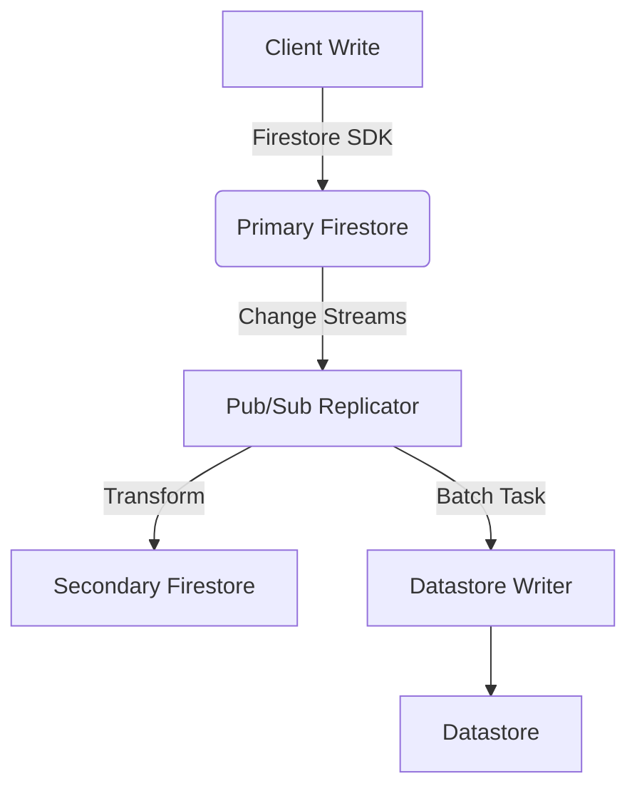

# マルチリージョン Firestore → Datastore レプリケーション設計

## 目的

- リージョン障害時でも主要機能（習慣CRUD、進捗同期、通知スケジュール）を継続
- 分析・バックアップ用にDatastoreへ整形済みデータを複製
- レイテンシ最小化のためユーザーの所属リージョンに応じた読み書き先を選択

## アーキテクチャ概要

1. **Primary Firestore (asia-northeast1)**
   - 書き込みの単一ソース。`quests`, `progress_logs`, `pair_sessions` コレクションが存在。
2. **Secondary Firestore (us-central1)**
   - Cloud Firestoreのマルチリージョンレプリケーションではなく、Pub/Sub + Cloud Functionsで非同期複製。
   - 重要な読み込みのみフェイルオーバー時に切り替え。
3. **Analytics Datastore (us-central1 Datastore mode)**
   - BigQuery Export前処理用。レプリカ Firestore からCloud Tasks経由でバルク書き込み。
4. **Global Load Balancer + Cloud Run API**
   - クライアントSDKの直接Firestoreアクセスは継続しつつ、Critical Path APIはCloud Run経由でリージョンルーティング。

## データフロー

## コンポーネント詳細

### 1. Change Stream Processor
- Firestore Change Streams + Dataflow（Flex Template）で実装。
- Pub/Subメッセージには `collection`, `documentId`, `after`, `updatedAt`, `op` を含む。
- Message ordering key = `collection/documentId`。

### 2. Secondary Firestore Writer
- Cloud Functions (2nd Gen, Node.js18)
- Idempotent upsert。`update_time` 比較で古いイベントを破棄。
- 書き込み失敗はDead Letter Topicに送信し、Opsgenie通知。

### 3. Datastore整形
- Cloud Tasksキューにバッチ登録（50件単位）。
- Cloud RunサービスがDatastoreへ変換保存（Property制限を考慮して1ドキュメント=1Entity）。
- Datastore側でTTL Indexを設定し365日で自動削除。

## データ整合性

- Primary → Secondaryは最長60秒遅延を許容。`lastSyncedAt`をアプリに返却しステータスUI表示。
- Secondary障害時はPub/Subキューに滞留し、再稼働後に再処理。
- DatastoreはAnalytics専用のためEventually Consistent許容。

## 障害対応

| 障害パターン | 対応策 |
| --- | --- |
| Primary Firestore障害 | Cloud Run経由のAPIをSecondaryへFailover。書き込みはキューに保持。 |
| Secondary Firestore障害 | バックグラウンドジョブ停止、Opsgenieアラート、復旧後にDead Letter Topicをリプレイ。 |
| Datastore障害 | BigQuery ExportをPrimary Firestoreから直接実施する暫定手順。 |

## 運用

- `replication_lag_seconds` メトリクスをCloud Monitoringで収集し、5分移動平均が120秒超で警告。
- 月次でサンプルレコードを比較し、Diffが1%超の場合は検証タスクを発行。
- Cloud Schedulerで日次整合性ジョブを起動（Secondary→Primaryの件数比較）。

## セキュリティ

- サービスアカウントは原則最小権限。
- Pub/SubメッセージはKMSで暗号化。
- Datastore書き込みサービスはVPC-SC境界内でのみ動作。

## ロードマップ

1. MVP: Change Streams + Secondary Firestore複製
2. Datastore連携とBigQueryパイプライン
3. 高頻度コレクションのShardingと書き込み最適化
4. クライアントSDKの自動フェイルオーバー実装
